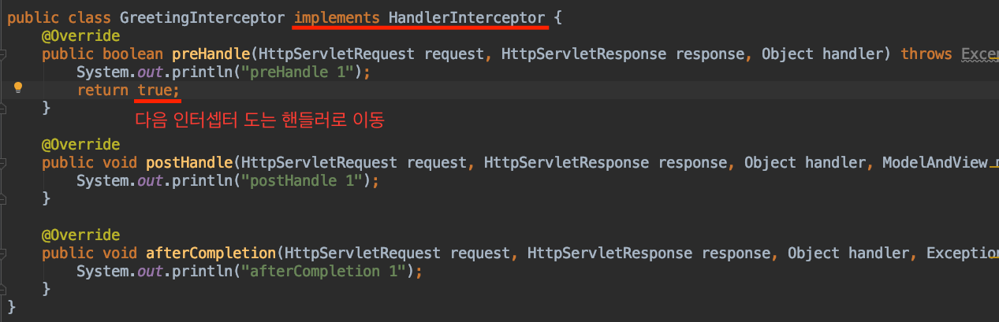
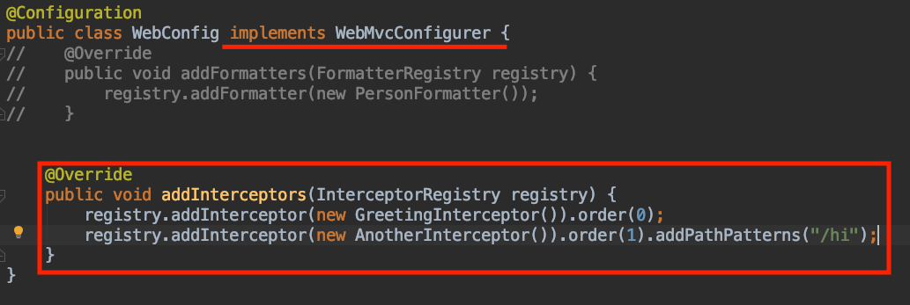
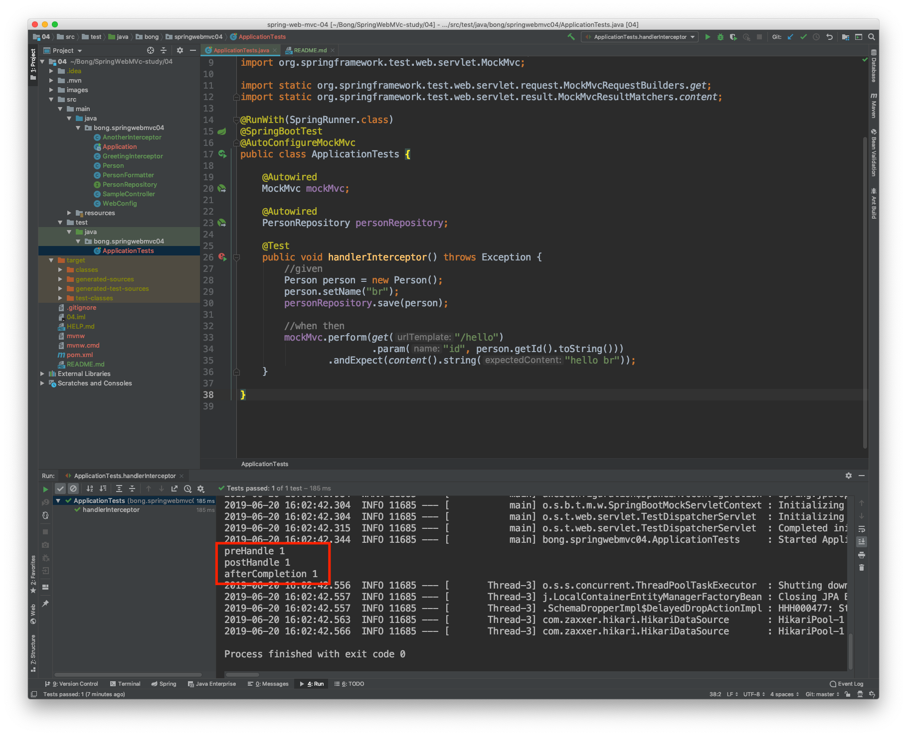

# 스프링 웹 MVC(inflearn) - 백기선 
## Springframework

### 핸들러 인터셉터
- [reference](https://docs.spring.io/spring-framework/docs/current/javadoc-api/org/springframework/web/servlet/HandlerInterceptor.html) 

#### HandlerInterceptor
- 핸들러 맵핑에 설정할 수 있는 인터셉터
- 핸들러를 실행하기 전, 후(아직 랜더링 전) 그리고 완료(랜더링까지 끝난 이후) 시점에 부가 작업을 하고 싶은 경우에 사용할 수 있다.
- 여러 핸들러에서 반복적으로 사용하는 코드를 줄이고 싶을 때 사용할 수 있다.
    - 로깅, 인증 체크, Locale 변경 등...

#### boolean preHandle(request, response, **handler**)
- 핸들러 실행하기 전에 호출 됨
- 핸들러에 대한 정보를 사용할 수 있기 때문에 서블릿 필터에 비해 보다 세밀한 로직을 구현할 수 있다.
- 리턴값으로 계속 다음 인터셉터 또는 핸들러로 요청,응답을 전달할지(true) 응답 처리가 이곳에서 끝났는지(false) 알린다.

#### void postHandle(request, response, **modelAndView**)
- 핸들러 실행이 끝나고 아직 뷰를 랜더링 하기 이전에 호출 됨
- “뷰"에 전달할 추가적이거나 여러 핸들러에 공통적인 모델 정보를 담는데 사용할 수도 있다.
- 이 메소드는 인터셉터 역순으로 호출된다.
    - 예) preHandle 1 -> preHandle 2 -> 요청처리 -> postHandler2 -> postHandler1
- 비동기적인 요청 처리 시에는 호출되지 않는다.
    - asyncHandlerInterceptor에서 다룬다. 

#### void afterCompletion(request, response, handler, ex)
- 요청 처리가 완전히 끝난 뒤(뷰 랜더링 끝난 뒤)에 호출 됨
- preHandler에서 true를 리턴한 경우에만 호출 됨
- 이 메소드는 인터셉터 역순으로 호출된다.
- 비동기적인 요청 처리 시에는 호출되지 않는다.

#### 서블릿 필터와 비교
- 서블릿 보다 구체적인 처리가 가능하다.(핸들러, 뷰가 제공된다.)
- 서블릿은 보다 일반적인 용도의 기능을 구현하는데 사용하는게 좋다.
    - 예) Cross-site scripting (XSS) attack 방지 → 뷰 or 핸들러의 정보는 필요없다..
        - naver에서 만든 LUCY필터가 있다.

#### 구현

- implements HandlerInterceptor

#### 핸들러 인터셉터 등록하기

- .order로 순서를 정할수 있다.
    - add 순으로 등록된다.
- .addPathPattern을 사용하여 원하는 핸들러에만 적용 가능

### testcode

- AnotherInterceptor는 PathPattern에 걸리지 않아서 제외
  

