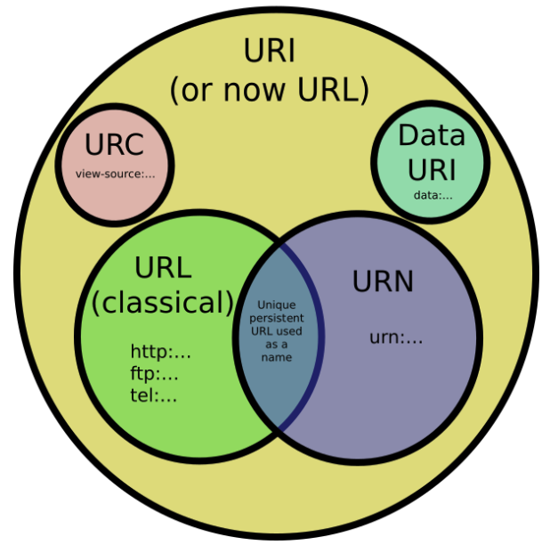
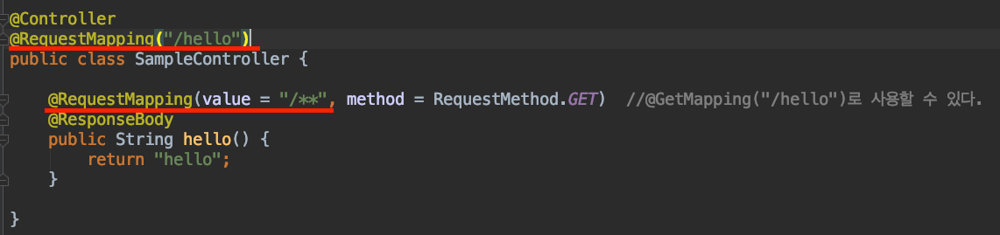
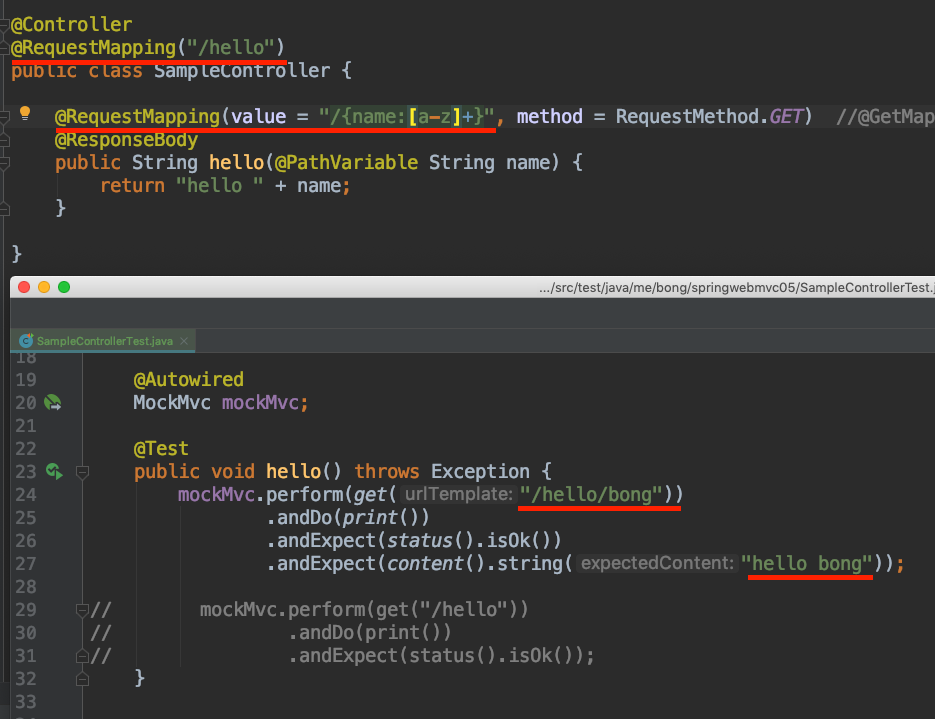
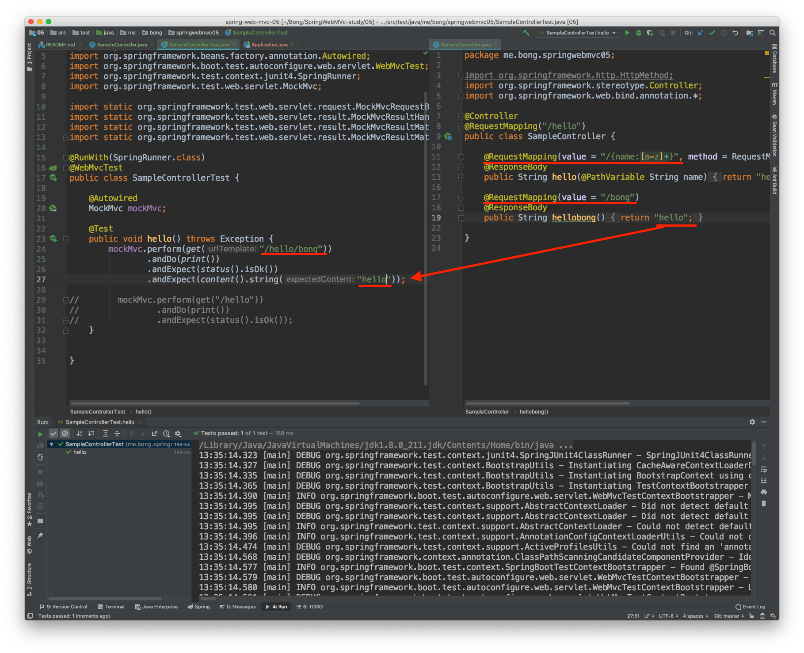

# 스프링 웹 MVC(inflearn) - 백기선 
## SpringMVC 활용

### 스프링 MVC 핵심 기술 소개
- [reference 문서](https://docs.spring.io/spring/docs/current/spring-framework-reference/web.html#mvc-controller)

#### 애노테이션 기반의 스프링 MVC
- 요청 맵핑하기
- 핸들러 메소드
- 모델과 뷰
- 데이터 바인더
- 예외 처리
- 글로벌 컨트롤러

#### 사용할 기술
- 스프링 부트
- 스프링 프레임워크 웹 MVC
- 타임리프

#### 학습 할 애노테이션
- @RequestMapping
    - @GetMapping, @PostMapping, @PutMapping, ...
- @ModelAttribute
- @RequestParam, @RequestHeader
- @PathVariable, @MatrixVariable
- @SessionAttribute, @RequestAttribute, @CookieValue
- @Valid
- @RequestBody, @ResponseBody
- @ExceptionHandler
- @ControllerAdvice
  

### HTTP요청 맵핑하기 - 요청 메소드
- Handler : 요청을 처리할 수 있는 메소드를 보통 핸들러라고 부른다.

- HTTP Method
    - GET, POST, PUT, PATCH, DELETE, ...

#### GET 요청
- 클라이언트가 서버의 리소스를 요청할 때 사용한다.
- 캐싱 할 수 있다. 
    - 캐시와 관련된 헤더를 응답에 실어 보낼 수 있다.
    - 동일한 요청을 보낼 때 조건적인 GET으로 바뀔 수 있다.
        - 304 not modified 라고 응답하면, body를 보내지 않아도 클라이언트 쪽에서 캐싱하고 있던 그정보 드대로 보여준다.   
- 브라우저 기록에 남는다.
- 북마크 할 수 있다.
- 민감한 데이터를 보낼 때 사용하지 말 것. (URL에 다 보이니까)
- idempotent (동일한 요청 시, 동일한 응답)

#### POST 요청
- 클라이언트가 서버의 리소스를 수정하거나 새로 만들 때 사용한다. (idempotent X)
- 서버에 보내는 데이터를 POST 요청 본문에 담는다.
- 캐시할 수 없다.
- 브라우저 기록에 남지 않는다.
- 북마크 할 수 없다.
- 데이터 길이 제한이 없다.

#### PUT 요청
- URI에 해당하는 데이터를 새로 만들거나 수정할 때 사용한다.
- POST와 다른 점은 “URI”에 대한 의미가 다르다.
    - POST의 URI는 보내는 데이터를 처리할 리소스를 지칭하며
    - PUT의 URI는 보내는 데이터에 해당하는 리소스를 지칭한다.
- Idempotent

#### PATCH 요청
- PUT과 비슷하지만, 기존 엔티티와 새 데이터의 차이점만 보낸다는 차이가 있다.
    - 일부의 데이터만 수정하고 싶을 때, 사용   
- Idempotent

#### DELETE 요청
- URI에 해당하는 리소스를 삭제할 때 사용한다.
- Idempotent

#### 스프링 웹 MVC에서 HTTP method 맵핑하기
● @RequestMapping(method=RequestMethod.GET)
● @RequestMapping(method={RequestMethod.GET, RequestMethod.POST})
● @GetMapping, @PostMapping, ...

#### 참고
- https://www.w3schools.com/tags/ref_httpmethods.asp
- https://tools.ietf.org/html/rfc2616#section-9.3
- https://tools.ietf.org/html/rfc2068
  

### HTTP 요청 맵핑하기 - URI패턴 맵핑
#### URI, URL, URN

- [참고](https://stackoverflow.com/questions/176264/what-is-the-difference-between-a-uri-a-url-and-a-urn)

#### 요청 맵팽하기
- @RequestMapping은 다음의 패턴을 지원합니다.
    - ? : 한 글자 (“/author/???” => “/author/123”)
    - \* : 여러 글자 (“/author/*” => “/author/keesun”)
    - \*\* : 여러 패스 (“/author/** => “/author/keesun/book”)
- @RequestMapping은 클래스에도 선언이 가능하며, 조합도 가능하다.
    
- 정규표현식 맵핑도 가능하다. (띄어쓰기 주의)
    
- 패턴이 중복되는 경우
    - 가장 구체적으로 맵핑되는 핸들러를 선택한다.
    

- URI 확장자 맵핑 지원
    - 스프링 mvc는 기본적으로 지원한다.
        - 예를 들어 "/bong"으로 매핑 시, "/bong.*"을 함께 맵핑
            - "/bong.json", "/bong.html", "/bong.xml"등을 암묵적으로 맵핑해준다.
    - 이 기능은 권장하지 않음 (**스프링부트에서는 기본적으로 이 기능을 사용하지 않도록 설정해준다.**)
        - 보안 이슈(RFD Attack)
            - Reflected File Download
            - https://www.trustwave.com/en-us/resources/blogs/spiderlabs-blog/reflected-file-download-a-new-web-attack-vector/
            - https://www.owasp.org/index.php/Reflected_File_Download
            - https://pivotal.io/security/cve-2015-5211
        - URI변수, Path 매개변수, URI 인코딩을 사용할 때 불명확함.

- 최근에는 accept header에 요청할 파일의 확장자를 설정해준다.
    - header를 통해 응답의 유형을 판단할 수 있다.(권장)
    - request parameter를 통해 설정할수도 있다.(차선책)
        - ex).. "/bong?type=xml"
  

